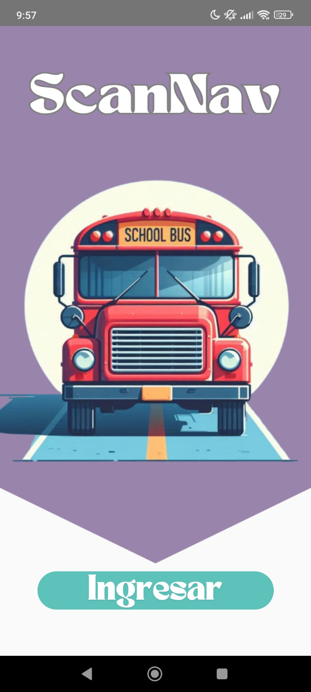
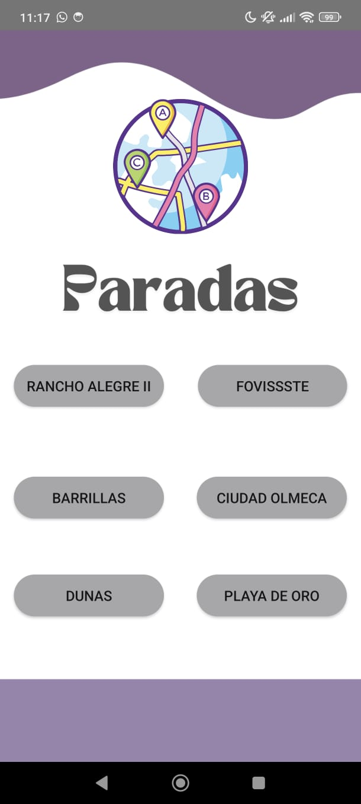
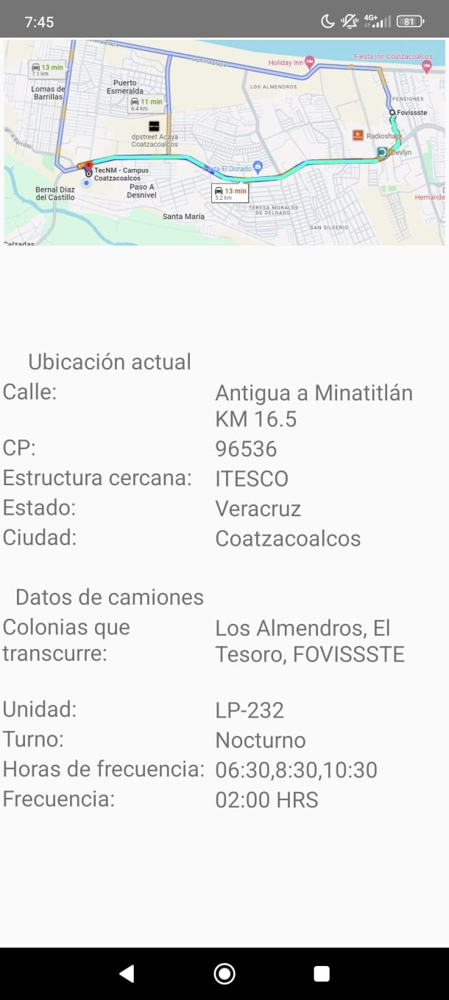

<html lang="es">
<head>
    <meta charset="UTF-8">
    <meta name="viewport" content="width=device-width, initial-scale=1.0">
    <title>Promoción de la Aplicación</title>
    <link rel="stylesheet" href="styles.css">
    
</head>
<body>
    <header>
        <h1>Bienvenido a Nuestra Aplicación</h1>
    </header>
    <main>
        <section id="about">
            <h2>Sobre la Aplicación</h2>
            
Descubre ScanNav: tu guía nocturna infalible. Escanea, navega y llega seguro. ¡Conquista la noche sin miedo! 🚀...

        </section>
        <section id="video">
            <h2>Video de la Aplicación</h2>
            <video controls>
                <source src="nidia-scannav_vEcJhRoP.mp4" type="video/mp4">
                Tu navegador no soporta la reproducción de videos.
            </video>
        </section>
        <section id="features">
            <h2>Características</h2>
            <ul>
                <li>Mapas Claros y Detallados: ScanNav proporciona mapas nítidos y detallados que resaltan las rutas más seguras para llegar a tu destino durante la noche.</li>
                <li>Marcadores de Seguridad: Identifica fácilmente las áreas bien iluminadas y los puntos de referencia seguros, facilitando una navegación más tranquila y confiable.</li>
                <li>Interfaz Intuitiva: Con una interfaz fácil de usar, ScanNav permite planificar tu ruta nocturna en cuestión de segundos, asegurándote un viaje sin complicaciones.</li>
            </ul>
        </section>
        <section id="download">
            <h2>Descargar Aplicación</h2>
            <button onclick="openGoogle()">PROXIMAMENTE...</button>
        </section>
        <!-- Sección de imagen centrada -->
        <section class="center-image">
            
        </section>
        <!-- Segunda imagen centrada -->
        <section class="center-image">
            
        </section>
        <!-- Tercera imagen centrada -->
        <section class="center-image">
            
        </section>
    </main>
    <footer>
        
&copy; 2024 ScanNav.

    </footer>
    
</body>
</html>
